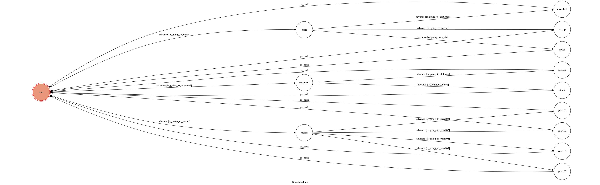

# TOC Project 2017

Template Code for TOC Project 2017

A telegram bot based on a finite state machine

## Setup

### Prerequisite
* Python 3

#### Install Dependency
```sh
pip install -r requirements.txt
```

* pygraphviz (For visualizing Finite State Machine)
    * [Setup pygraphviz on Ubuntu](http://www.jianshu.com/p/a3da7ecc5303)

### Secret Data

`API_TOKEN` and `WEBHOOK_URL` in app.py **MUST** be set to proper values.
Otherwise, you might not be able to run your code.

### Run Locally
You can either setup https server or using `ngrok` as a proxy.

**`ngrok` would be used in the following instruction**

```sh
ngrok http 5000
```

After that, `ngrok` would generate a https URL.

You should set `WEBHOOK_URL` (in app.py) to `your-https-URL/hook`.

#### Run the sever

```sh
python3 app.py
```

## Finite State Machine


## Usage
The initial state is set to `user`.
### Init
	* option:
		*basic(基本排球介紹)
		*advanced(進階排球介紹)
		*record(歷年成績查詢)
### basic
	*option:
		*crouched(低手介紹)
		*set_up(高手介紹)
		*spike(攻擊介紹)

### advanced
	*option:
		*defence(防守站位介紹)
		*attack(攻擊戰術介紹)
	
### record
	*option:
		*102(102學年成績查詢)
		*103(103學年成績查詢)
		*104(104學年成績查詢)
		*105(105學年成績查詢)
	
## Author
[Lee-W](https://github.com/Lee-W)
